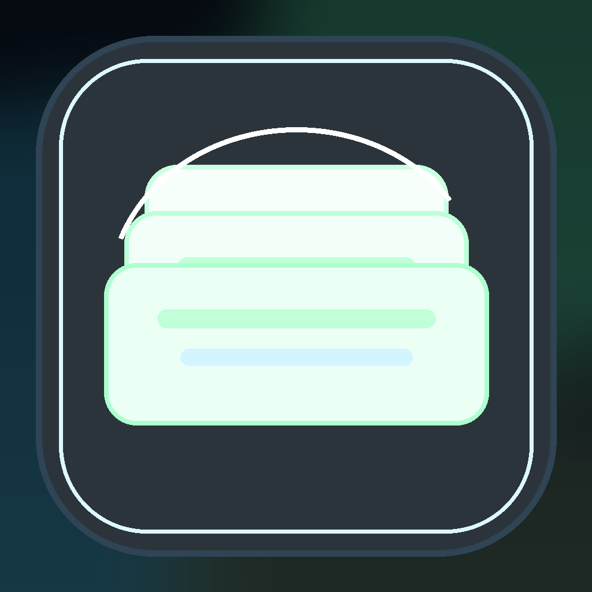
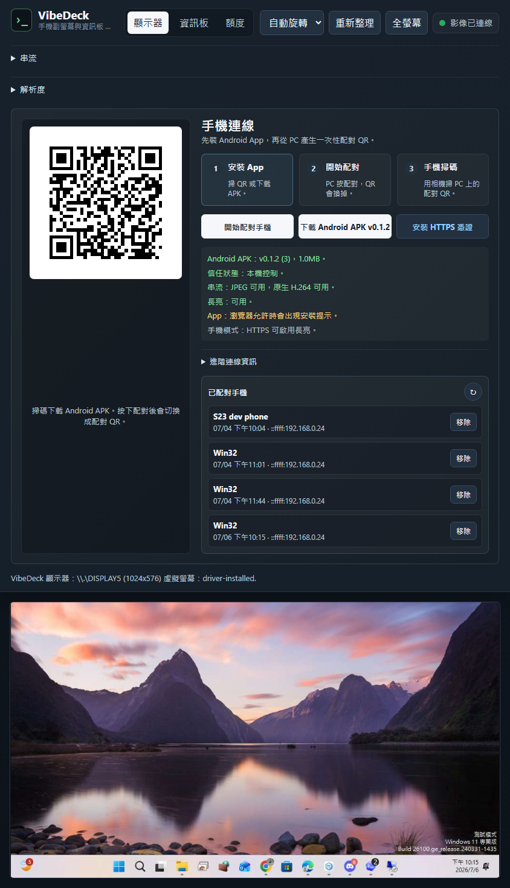
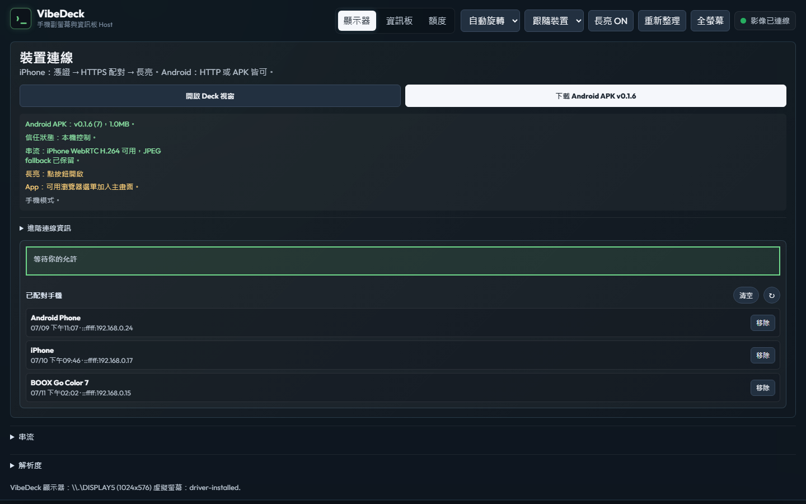
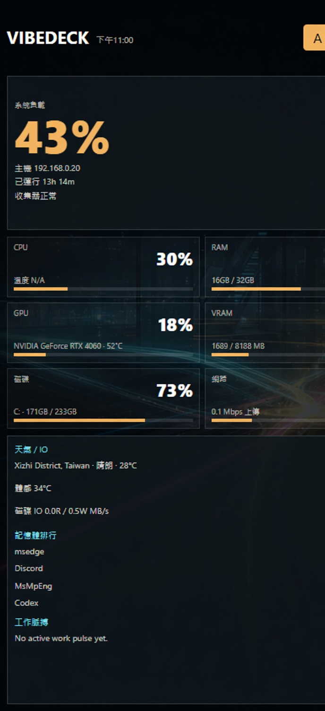
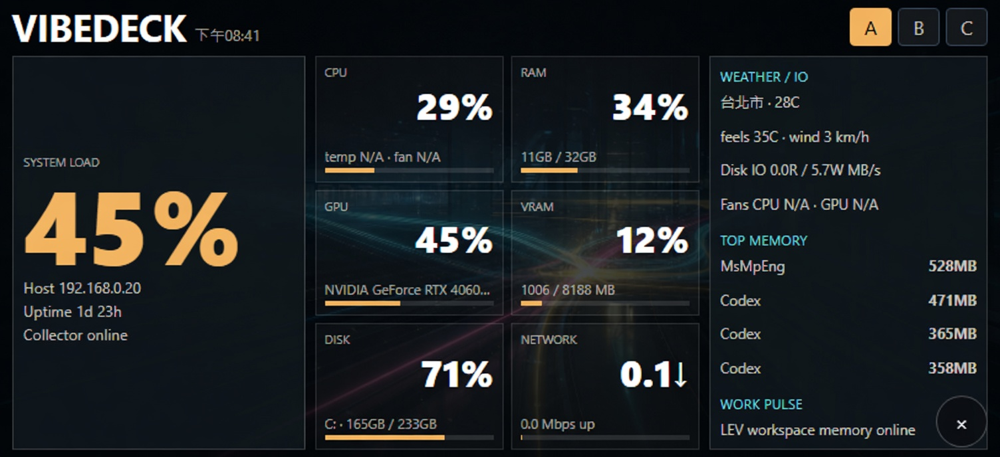
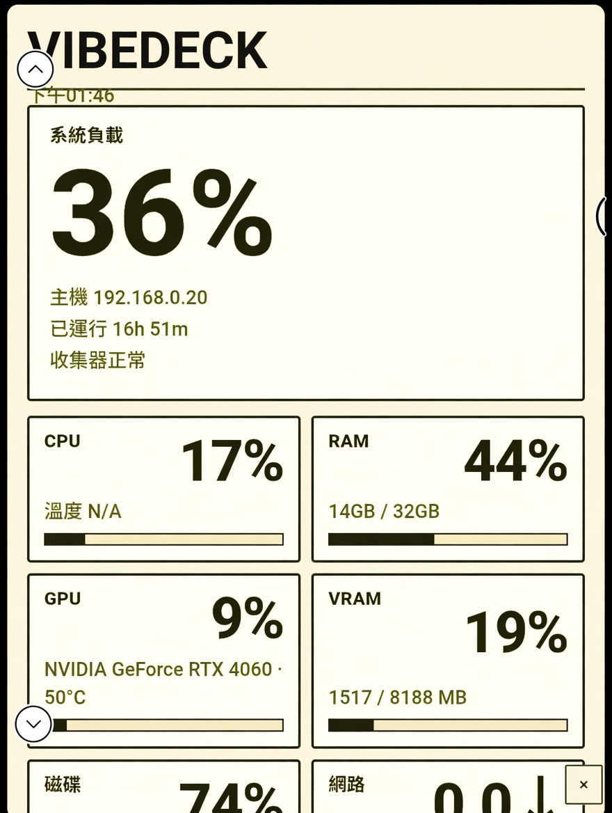

# VibeDeck

<p align="center">
  
</p>

<p align="center">
  <strong>EN</strong> · Turn an idle phone into a PC side display and command deck<br/>
  <strong>中文</strong> · 把閒置手機變成電腦副螢幕與指令資訊板
</p>

<p align="center">
  <a href="#english">English</a> ·
  <a href="#中文">中文</a> ·
  <a href="LICENSE">MIT License</a>
</p>

---

## Screenshots · 截圖

| Display stream · 顯示器串流 | Device connect · 裝置連線 |
|:---:|:---:|
|  |  |

| Sideboard · 資訊板 | Command layout · 指揮版面 |
|:---:|:---:|
|  |  |

| E-ink / BOOX · 電子紙 |
|:---:|
|  |

---

<a id="english"></a>

## English

### What is VibeDeck?

VibeDeck is a **Windows Host** that:

1. Creates a real **virtual display** (Indirect Display Driver)
2. Streams it to a phone over the **LAN** (WebRTC H.264 / JPEG)
3. Offers a phone-sized **Sideboard** (CPU / GPU / weather / work pulse)
4. Shows **AI quotas** (Codex + AGY; no Claude Code quota path)

### Platform support

| Platform | Client | Notes |
|----------|--------|--------|
| **Windows PC** | Host + optional IDD driver | Required |
| **iPhone** | Safari / Add to Home Screen **only** | WebRTC H.264 + JPEG fallback. **No native iOS app** |
| **Android** | PWA and/or APK under `apps/android` | Native keep-awake + MediaCodec H.264 |
| **BOOX / e-ink** | Browser or Android path | Same Host protocol |

### Features

- LAN pairing with QR + PC approval, device tokens, revoke list
- Local HTTPS (`:5443`) with auto-generated root cert for Wake Lock / PWA
- JPEG WebSocket fallback; WebRTC H.264 when FFmpeg is available
- Sideboard telemetry owned by the Host (no external dashboard required)
- AI quota page with AGY OAuth (credentials **not** in the repo)
- Android native shell: deep links, Deck Window, H.264 viewer

### Quick start

```powershell
# From repo root
scripts\dev-run.ps1
```

Or:

```powershell
dotnet build PhoneMonitor.sln
src\PhoneMonitor.Host\bin\Debug\netcoreapp3.1\PhoneMonitor.Host.exe --urls http://0.0.0.0:5000
```

| URL | Use |
|-----|-----|
| `http://127.0.0.1:5000` | PC local |
| `http://<PC-LAN-IP>:5000` | Phone HTTP bootstrap |
| `https://<PC-LAN-IP>:5443` | Phone HTTPS (after trusting cert) |

### iPhone setup (canonical path)

1. Open Host **HTTP** → install `phone-monitor-root.cer`
2. iOS Settings → General → About → Certificate Trust Settings → enable full trust
3. Open Host **HTTPS** → pair once on the PC
4. Share → **Add to Home Screen**
5. Use **Display** (WebRTC H.264) and turn **Keep awake** on when needed

### Android (optional native)

```powershell
scripts\check-android-toolchain.ps1
scripts\build-android-app.ps1
scripts\install-android-app-dev.ps1
```

Debug APK: `apps\android\app\build\outputs\apk\debug\app-debug.apk`  
Release flow: `docs/android-apk-distribution.md`

### Virtual display driver (optional)

```powershell
scripts\check-driver-toolchain.ps1
scripts\install-driver-toolchain.ps1
scripts\fetch-idd-sample.ps1
scripts\build-driver.ps1
scripts\install-driver-dev.ps1
```

Windows then exposes **PhoneMonitor Display** in Settings.

### First-time AI quotas (new users)

Quotas are read **on the PC running the Host**, not by the phone alone. Open **額度 / Quotas** in the UI for the same steps.

**Codex**

1. Install and sign in to Codex on the **same Windows PC** as the Host (`%USERPROFILE%\.codex`).
2. Use Codex once so session logs contain a `rate_limits` event.
3. Open VibeDeck → **額度 → Codex** → **↻**.
4. There is **no** Codex OAuth or “import token” button — VibeDeck only scans local sessions.

**AGY**

1. Put Google OAuth client credentials on the Host PC:
   - Env: `AGY_GOOGLE_CLIENT_ID` / `AGY_GOOGLE_CLIENT_SECRET`, or
   - File: `%LOCALAPPDATA%\PhoneMonitor\secrets\agy-google-oauth.json`  
   Template: [`docs/agy-google-oauth.example.json`](docs/agy-google-oauth.example.json)
2. Open **額度 → AGY** → **+** (PC browser completes Google sign-in).
3. Press **↻** to refresh Claude/Gemini remaining quota from Antigravity APIs.
4. Tokens live under `%LOCALAPPDATA%\PhoneMonitor\quotas\agy\` (not in the repo).

### Docs

| Doc | Topic |
|-----|--------|
| [docs/protocol.md](docs/protocol.md) | Pairing & streams |
| [docs/https-onboarding.md](docs/https-onboarding.md) | Cert / HTTPS |
| [docs/mobile-app.md](docs/mobile-app.md) | PWA + Android |
| [docs/product-vision.md](docs/product-vision.md) | Product direction |
| [docs/remote-desktop-streaming.md](docs/remote-desktop-streaming.md) | H.264 / WebRTC notes |
| [docs/ai-quota-sources.md](docs/ai-quota-sources.md) | Quota providers |

### License

[MIT](LICENSE)

---

<a id="中文"></a>

## 中文

### VibeDeck 是什麼？

VibeDeck 是跑在 **Windows** 上的 Host，用來：

1. 建立真實的 **虛擬螢幕**（Indirect Display Driver）
2. 透過 **區網** 串流到手機（WebRTC H.264 / JPEG）
3. 提供手機尺寸的 **資訊板**（CPU / GPU / 天氣 / 工作脈搏）
4. 顯示 **AI 額度**（Codex、AGY；Claude Code 尚無接入，不提供空殼分頁）

### 平台支援

| 平台 | 用戶端 | 說明 |
|------|--------|------|
| **Windows PC** | Host + 可選虛擬顯示驅動 | 必要 |
| **iPhone** | **僅** Safari / 加入主畫面 | WebRTC H.264 + JPEG。**沒有 iOS 原生 App** |
| **Android** | PWA 與／或 `apps/android` APK | 原生長亮 + MediaCodec H.264 |
| **BOOX / 電子紙** | 瀏覽器或 Android 路徑 | 同一套 Host 協定 |

### 功能重點

- 區網配對：QR + PC 核准、裝置 token、可撤銷
- 本機 HTTPS（`:5443`）自動憑證，支援長亮 / PWA
- JPEG WebSocket 備援；有 FFmpeg 時走 WebRTC H.264
- 資訊板遙測由 Host 自己收集
- AI 額度頁；AGY OAuth **憑證不進 repo**
- Android 原生殼：deep link、Deck 視窗、H.264 檢視

### 快速啟動

```powershell
# 在 repo 根目錄
scripts\dev-run.ps1
```

或：

```powershell
dotnet build PhoneMonitor.sln
src\PhoneMonitor.Host\bin\Debug\netcoreapp3.1\PhoneMonitor.Host.exe --urls http://0.0.0.0:5000
```

| 網址 | 用途 |
|------|------|
| `http://127.0.0.1:5000` | 本機 PC |
| `http://<電腦區網IP>:5000` | 手機 HTTP 起步 |
| `https://<電腦區網IP>:5443` | 手機 HTTPS（憑證信任後） |

### iPhone 標準路徑（推薦）

1. 用 **HTTP** 開 Host → 安裝 `phone-monitor-root.cer`
2. 設定 → 一般 → 關於本機 → 憑證信任設定 → 開啟完整信任
3. 改開 **HTTPS** → 在 PC 上完成一次配對
4. 分享 → **加入主畫面**
5. 用 **顯示器**（WebRTC H.264），需要時開 **長亮**

### Android（可選原生）

```powershell
scripts\check-android-toolchain.ps1
scripts\build-android-app.ps1
scripts\install-android-app-dev.ps1
```

除錯 APK：`apps\android\app\build\outputs\apk\debug\app-debug.apk`  
發行流程：`docs/android-apk-distribution.md`

### 虛擬顯示驅動（可選）

```powershell
scripts\check-driver-toolchain.ps1
scripts\install-driver-toolchain.ps1
scripts\fetch-idd-sample.ps1
scripts\build-driver.ps1
scripts\install-driver-dev.ps1
```

安裝後 Windows 設定會出現 **PhoneMonitor Display**。

### 首次 AI 額度（新使用者）

額度是在 **跑 Host 的那台 PC** 讀本機資料，手機只顯示結果。UI **額度** 頁也有同樣說明。

**Codex**

1. 在與 Host **同一台 Windows** 安裝並登入 Codex（`%USERPROFILE%\.codex`）。
2. 先正常用一次 Codex，讓 session 出現 `rate_limits`。
3. VibeDeck → **額度 → Codex** → **↻**。
4. **沒有** Codex OAuth／貼 token 匯入——只掃本機 session。

**AGY**

1. 在 Host 本機放 Google OAuth：
   - 環境變數 `AGY_GOOGLE_CLIENT_ID` / `AGY_GOOGLE_CLIENT_SECRET`，或
   - `%LOCALAPPDATA%\PhoneMonitor\secrets\agy-google-oauth.json`  
   範本：[`docs/agy-google-oauth.example.json`](docs/agy-google-oauth.example.json)
2. **額度 → AGY** → **+**（PC 瀏覽器完成 Google 登入）。
3. 再按 **↻** 拉 Antigravity 的 Claude／Gemini 剩餘額度。
4. Token 存在 `%LOCALAPPDATA%\PhoneMonitor\quotas\agy\`（不進 repo）。

### 授權

[MIT](LICENSE)

---

<p align="center">
  Built for desk-side phones · 給桌邊那支閒置手機
</p>
