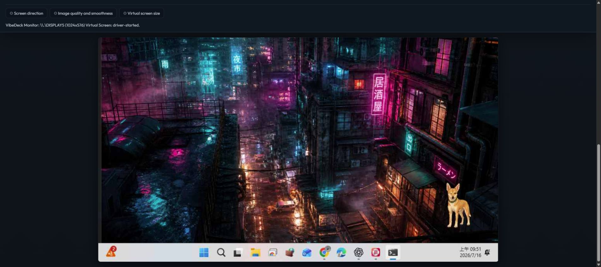
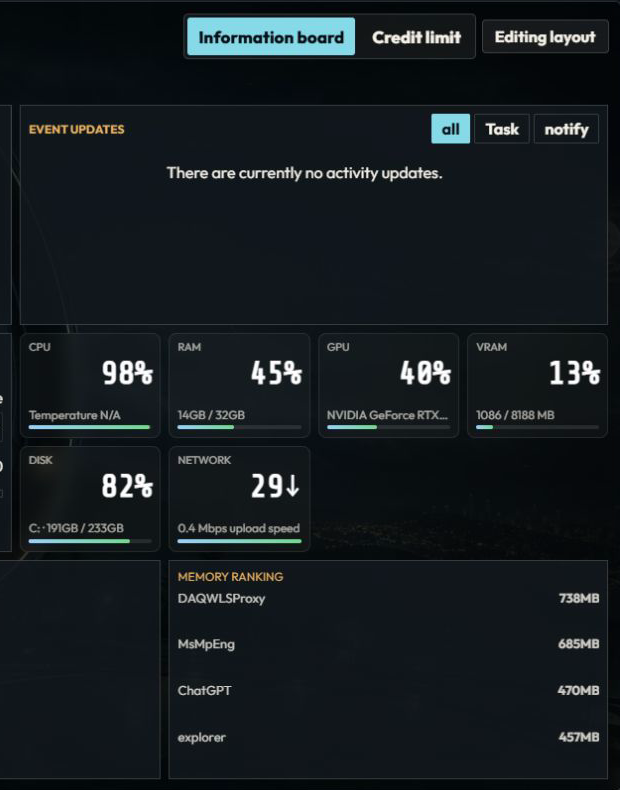

# VibeDeck

VibeDeck turns a spare phone or e-paper device into a private wireless second screen, system dashboard, and AI-usage sideboard for Windows.

It runs locally: the Windows Host creates and captures an optional virtual display, while iPhone, Android, and BOOX devices connect through Safari, Chrome, or an installable PWA. No native mobile app or cloud account is required.

## Product Architecture

| Component | Supported product path |
|---|---|
| Windows Host | Install with `VibeDeck-Setup-<version>.exe`; it starts in the signed-in desktop session |
| Phone and e-paper clients | Safari, Chrome, or Add to Home Screen/PWA |
| Virtual display | Optional; required only for second-screen mode |
| Windows notifications | Optional packaged companion; it forwards notifications to the Host |
| Product updates | Run a newer Setup with the same AppId |
| Source development | Use `start.bat` or `scripts\dev-run.ps1` |

The Host must not run as a Windows Service. A service runs in Session 0 and cannot enumerate or capture displays belonging to the signed-in user. VibeDeck instead launches as a hidden background process in the interactive desktop session.

## Features

- A real Windows virtual monitor that accepts normal desktop windows.
- Low-latency WebRTC H.264 streaming with a JPEG compatibility fallback.
- Responsive phone, tablet, and e-paper layouts from one browser/PWA client.
- Live CPU, GPU, memory, storage, network, weather, and process information.
- AI-tool usage and quota cards.
- Configurable dashboard layouts and activity updates.
- Optional Windows notification integration.
- Local device approval and pairing without a third-party backend.
- Windows Setup, in-place updates, autostart, and persistent product data.

## Showcase

### Wireless second-screen mode

VibeDeck streams a live Windows virtual display to the browser client over the local network.



### Information Board

The same device can become a focused desktop sideboard with live system telemetry, process insights, and AI-usage information.



## Requirements

For an installed build:

- Windows 10 or Windows 11 on x64.
- A phone or e-paper device on the same Wi-Fi network, or connected through the same Tailscale network.
- The optional virtual display only when using second-screen mode.

Building from source additionally requires the .NET 8 SDK. Creating the Windows installer requires Inno Setup 6.

## Install VibeDeck

For a complete build + install from this repository, double-click `install.bat`. It builds the canonical Setup, requests administrator permission once, installs silently, starts the Host hidden, and verifies the running product.

Run the packaged installer:

```text
VibeDeck-Setup-<version>.exe
```

Setup performs the complete product installation:

- installs the application under `C:\Program Files\VibeDeck`;
- stores persistent product data under `%ProgramData%\VibeDeck`;
- creates Start menu and desktop shortcuts;
- configures hidden autostart in the signed-in desktop session;
- creates the firewall rules required for LAN access;
- removes obsolete VibeDeck Windows Service registrations.

After installation, open:

```text
http://127.0.0.1:5000
```

### Build the installer from source

```powershell
scripts\package-windows-setup.ps1
```

The default version comes from `src/PhoneMonitor.Host/PhoneMonitor.Host.csproj`. To specify it explicitly:

```powershell
scripts\package-windows-setup.ps1 -Version 0.1.1
```

Output:

```text
artifacts\windows-setup\VibeDeck-Setup-<version>.exe
```

To build only the installation payload without compiling the Setup executable:

```powershell
scripts\package-windows-setup.ps1 -SkipInno
```

The packaging script normally runs tests, JavaScript syntax checks, product-path checks, and payload validation before producing the installer.

## Update an Existing Installation

From this repository, double-click `update.bat`. The update uses the same Setup AppId and performs this sequence automatically: stop the running Host, replace the app files, preserve `%ProgramData%\VibeDeck`, start the Host hidden, and run the installed-product checks. Do not uninstall first.

1. Build or download a newer Setup version.
2. Run it without uninstalling the existing version.
3. Setup stops the old Host, replaces application files, removes obsolete service registrations, and starts the new Host in the desktop session.
4. `%ProgramData%\VibeDeck` is preserved, including paired devices, certificates, quota accounts, custom cards, and notification settings.

Verify the updated installation:

```powershell
scripts\test-product-flow.ps1 -Installed
```

If the optional virtual display is installed:

```powershell
scripts\test-product-flow.ps1 -Installed -RequireVirtualDisplay
```

These checks verify that:

- no obsolete Host service remains;
- the Host runs outside Session 0;
- port 5000 belongs to the correct Host process;
- Windows display enumeration is coming from the interactive session;
- the PhoneMonitor virtual display is available when required.

## Connect a Phone or E-Paper Device

With both devices on the same Wi-Fi network, open the HTTPS address shown by the PC Host, for example:

```text
https://192.168.1.20:5443
```

On first connection:

1. Request pairing from the phone.
2. Confirm the device name and six-digit code on the PC.
3. Select **Allow** on the PC.
4. Switch between Display, Information Board, and Quota modes on the client.

The phone and PC show the same explicit pairing progress:

| Progress | Meaning |
|---:|---|
| 0–20% | Host, HTTPS address, and QR code are being prepared |
| 25% | Phone reached the Host and is waiting for **Start pairing** |
| 40% | Browser identity and the exact available device model are being read |
| 70–75% | Request and six-digit code reached the PC; waiting for **Allow** |
| 90% | Approval succeeded and the persistent credential is being saved |
| 100% | Pairing is saved, or an existing pairing was restored; the page reloads automatically |

Pairing is attached to a persistent browser-instance ID and stored under `%ProgramData%\VibeDeck\devices`. Re-pairing the same browser continues the existing device record and rotates its credential instead of adding a duplicate. Android Chromium reports its model when available, so known devices appear as names such as `BOOX Go Color 7` and `Samsung SM-S9110`; browsers that intentionally hide the model fall back to a platform name.

Information Board and Quota modes do not require the virtual display. iPhone, Android, and BOOX all use the same Host-served web application; responsive and e-paper styles handle platform differences.

For access across different networks, use Tailscale. See `docs/remote-access.md`. HTTPS and iPhone certificate setup are documented in `docs/https-onboarding.md`.

## Virtual Display

Only Display mode requires the PhoneMonitor virtual display.

When the PC UI reports that no virtual display is available, select **Create virtual display** and approve the Windows elevation prompt. Normal users do not need the Windows Driver Kit, test-signing mode, or driver-development scripts.

The Host must run in the local signed-in desktop session. If `/api/displays` reports only `WinDisc 1024x768`, the Host is running in the wrong session; this is not evidence that the virtual display driver is missing.

Driver-development tools remain under `driver/` and `scripts/*driver*.ps1`, but they are not part of the normal product installation path.

## Windows Notification Companion

Windows `userNotificationListener` access requires packaged application identity, so notification capture is implemented as an optional MSIX companion. It forwards notification data to the Host and must not listen on ports 5000 or 5443.

Build and install the development package:

```powershell
scripts\package-windows-notifications.ps1 -Install
```

If Windows requires machine-level trust for the development certificate, run from an elevated PowerShell window:

```powershell
scripts\package-windows-notifications.ps1 -RegisterOnly -InstallCertificateMachine
```

The companion process is `VibeDeck.Notifications.exe`. See `docs/windows-notifications.md` for details.

## Run from Source

Start the project with:

```text
start.bat
```

or:

```powershell
scripts\dev-run.ps1
```

Source-development data is stored under `%LocalAppData%\PhoneMonitor`. Installed-product data is stored under `%ProgramData%\VibeDeck`.

The source and installed Hosts cannot use port 5000 at the same time. Stop the installed Host before starting source development. The notification companion may remain running.

Run the source product-flow checks with:

```powershell
scripts\test-product-flow.ps1 -Source
```

## Uninstall

Prefer Windows **Installed apps**, or run from an elevated PowerShell window:

```powershell
scripts\uninstall-windows-product.ps1
```

To preserve product data:

```powershell
scripts\uninstall-windows-product.ps1 -KeepData
```

The notification companion is a separate MSIX package. Remove it with:

```powershell
scripts\package-windows-notifications.ps1 -Uninstall
```

## Troubleshooting

| Symptom | First check |
|---|---|
| PC page does not open | Start VibeDeck, then run `scripts\test-product-flow.ps1 -Installed` |
| Virtual display is installed but missing | Check the Host session; do not reinstall the driver solely because `WinDisc` appears |
| Phone cannot connect | Confirm Wi-Fi/Tailscale connectivity, firewall access, and the HTTPS URL |
| Phone UI looks like an old app | Close obsolete clients and use Safari, Chrome, or the PWA |
| A paired phone asks to pair again | Run `scripts\test-product-flow.ps1 -Installed`, then verify `%ProgramData%\VibeDeck\devices\trusted-devices.json`; Setup grants signed-in users write access and the Host keeps a `.bak` recovery copy |
| Refresh briefly opens PowerShell | Update to the latest Setup; the local information collector is launched non-interactively with a hidden window |
| Windows notifications do not appear | Confirm that the companion is connected and allowed |
| Data appears missing after an update | Verify `%ProgramData%\VibeDeck`; do not confuse it with the development data directory |
| Quota cards have no data | Use the corresponding local CLI/account on the Host PC, then refresh the card |

## Repository Structure

- `src/PhoneMonitor.Host`: Windows Host, APIs, streaming, and browser/PWA client.
- `packaging/windows-setup`: canonical Windows Setup packaging.
- `packaging/windows-notifications`: optional notification companion package.
- `scripts/test-product-flow.ps1`: shared source, payload, and installed-product checks.
- `driver`: virtual display development project.
- `docs`: protocol, remote access, HTTPS, notifications, product, and release documentation.
- `AGENTS.md`: engineering constraints for future development and debugging.

## Release Checklist

```powershell
scripts\test-product-flow.ps1 -Source
scripts\package-windows-setup.ps1
# Run the new Setup for a clean installation or in-place update.
scripts\test-product-flow.ps1 -Installed
```

See `docs/release-checklist.md` for the complete manual checklist.

## OpenAI Build Week

VibeDeck entered OpenAI Build Week as an existing Windows virtual-display prototype. During the submission period, it was meaningfully extended into a complete product workflow with Codex and GPT-5.6.

Build Week work includes:

- redesigned responsive phone and e-paper interfaces, including rotation and overlay fixes;
- a Windows Setup and upgrade path that preserves product data and starts the Host in the signed-in desktop session;
- improved virtual-display discovery and setup guidance;
- a single browser/PWA product path for iPhone, Android, and BOOX devices;
- configurable dashboard layouts, activity updates, quota cards, and optional Windows notification integration;
- installed-product and source-product flow checks for packaging and release verification.

Codex was used as an engineering partner for product planning, implementation, debugging, review, testing, and packaging. GPT-5.6 helped reason across Windows desktop-session behavior, display enumeration, browser-media constraints, mobile and e-paper layouts, and installer lifecycle.

Dated commits and Codex session logs document work completed during the event. The primary Build Week Codex session ID is:

```text
019f6890-877f-71e0-9ffa-7cf4d4457f2a
```

## Roadmap

- Add a maintainable internationalization layer. The current interface is primarily Traditional Chinese; English is the first planned additional language.
- Improve adaptive stream quality and latency handling.
- Add more dashboard modules and integrations.
- Make e-paper refresh behavior configurable.
- Simplify signed distribution for non-technical users.

## License

[MIT](LICENSE)
