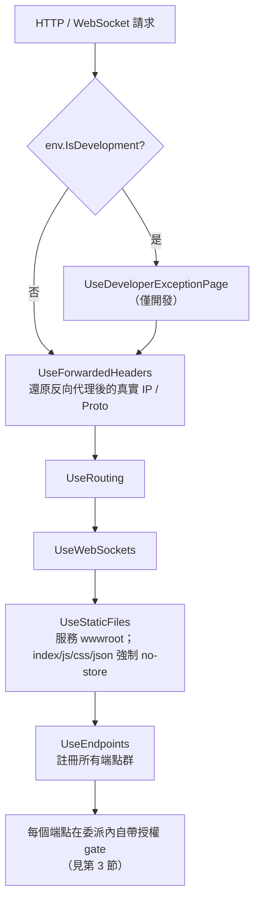
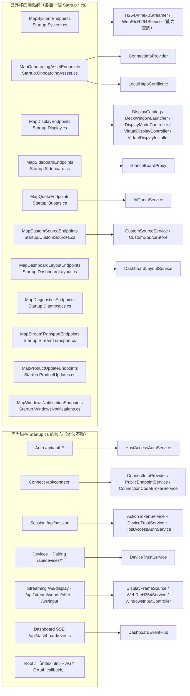
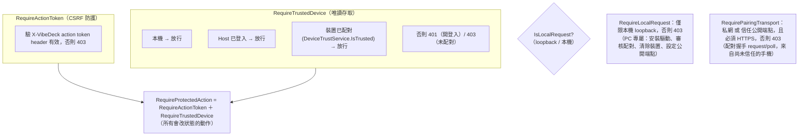

# VibeDeck Host 後端架構圖（Startup 管線 + 端點群 + 授權）

盤點日期：2026-07-22
基準版本：`refactor/startup-display-endpoints`（源自 `master` / 0.1.36）

這份文件把 `PhoneMonitor.Host` 的 HTTP/WebSocket 後端講清楚：**中介軟體管線順序**、**端點依責任分成哪些群（各自一個 `Startup.*.cs` partial）**、**每群呼叫哪些服務**、以及**每個端點套哪一層授權 gate**。目的是消除「所有東西擠在 `Startup.cs`」的義大利麵，讓後續改動能看圖定位。

`Startup` 是一個 `partial class`，拆成多個檔案，但編譯期仍是同一個型別；共用的私有 helper（`Require*`、`WriteAudit`、`SocketJsonOptions`、各種 `Write*Async`）留在 `Startup.cs`，各 partial 直接呼叫。

---

## 1. 中介軟體管線（請求進來的固定順序）

順序就是安全契約，不能隨意調換。定義在 `Startup.Configure`。

重點：授權**不是**一層全域 middleware，而是每個端點在自己的處理委派最前面呼叫 `Require*Async` gate。所以「哪個端點受哪種保護」要看端點本身，這也是為什麼把端點依 gate 分群後會清爽很多。

---

## 2. 端點群 → partial 檔 → 服務

`UseEndpoints` 內先呼叫各群的 `Map*Endpoints(endpoints)`，再保留安全垂直與串流等仍內聯的端點。

### 端點對照表

| 群 / partial | 代表端點 | 主要服務 | 授權 gate |
|---|---|---|---|
| `MapSystemEndpoints` | `/health`, `/api/stream/capabilities` | （能力查詢用 `H264AnnexBStreamer`/`WebRtcH264Service`） | 無（公開） |
| `MapOnboardingAssetEndpoints` | `/qr.svg`, `/cert/*` | `ConnectInfoProvider`, `LocalHttpsCertificate` | 無（唯讀公開資產） |
| `MapDisplayEndpoints` | `/api/displays`, `/api/deck/*`, `/api/display/*` | `DisplayCatalog`, `DeckWindowLauncher`, `DisplayModeController`, `VirtualDisplayController`, `VirtualDisplayInstaller` | 讀=TrustedDevice；改=ProtectedAction；`install`=ActionToken+Local |
| `MapSideboardEndpoints` | `/api/sideboard/stats\|work-pulse\|refresh` | `GlanceBoardProxy` | 讀=TrustedDevice；`refresh`=ProtectedAction |
| `MapQuotaEndpoints` | `/api/quotas/*`（12 個） | `AiQuotaService` | 讀=TrustedDevice；改=ProtectedAction |
| `MapCustomSourceEndpoints` | `/api/custom-sources/*` | `CustomSourceService` / `CustomSourceStore` | 見該 partial |
| `MapDashboardLayoutEndpoints` | `/api/dashboard/layout*` | `DashboardLayoutService` | 讀=TrustedDevice；寫=ProtectedAction |
| `MapDiagnosticsEndpoints` | 診斷 / 稽核 | 診斷服務 | 見該 partial |
| `MapStreamTransportEndpoints` | 串流傳輸協商 | 串流服務 | 見該 partial |
| `MapProductUpdateEndpoints` | 產品更新檢查/套用 | 更新服務 | 見該 partial |
| `MapWindowsNotificationEndpoints` | Windows 通知伴隨程式 | 通知服務 | 見該 partial |
| （內聯）Auth | `/api/auth/status\|login\|logout` | `HostAccessAuthService` | `login` 設定 session cookie；`status` 公開 |
| （內聯）Connect | `/api/connect`, `/api/connect/public-endpoint`, `device-code`, `eink-code` | `ConnectInfoProvider`, `PublicEndpointService`, `ConnectionCodeBrokerService` | 變更=ActionToken+Local |
| （內聯）Session | `/api/session` | `ActionTokenService`, `DeviceTrustService`, `HostAccessAuthService` | 對本機/已信任者發放 action token |
| （內聯）Devices/Pairing | `/api/devices/status\|revoke\|clear`, `/api/devices/pairing/request\|poll\|pending\|approve\|deny` | `DeviceTrustService` | 握手=PairingTransport；審核=ActionToken+Local；revoke=ProtectedAction |
| （內聯）Streaming | `/ws/display`, `/api/stream/webrtc/offer`, `/ws/input` | `DisplayFrameSource`, `WebRtcH264Service`, `WindowsInputController` | TrustedDevice |
| （內聯）Dashboard SSE | `/api/dashboard/events` | `DashboardEventHub` | TrustedDevice |
| （內聯）Root | `/` | 靜態 `index.html` + AGY OAuth callback | 無 |

---

## 3. 授權 gate（安全層）

授權集中在 5 個 `Require*Async` helper（都在 `Startup.cs`），端點在委派最前面呼叫。層級由鬆到嚴：

一句話對應：

- **公開**：`/health`、`/api/stream/capabilities`、`/qr.svg`、`/cert/*`、`/`、`/api/auth/status`。
- **RequireTrustedDevice**：唯讀資料（displays、sideboard、quotas、dashboard events、串流）。
- **RequireProtectedAction**（=ActionToken+TrustedDevice）：改狀態動作（deck 切換、display mode、sideboard refresh、quota 帳號操作）。
- **ActionToken + RequireLocalRequest**：只能從這台 PC 發起（安裝虛擬顯示器、`/api/devices/clear`、`pairing/pending\|approve\|deny`、`connect/public-endpoint`）。
- **RequirePairingTransport**：配對握手（`/api/devices/pairing/request\|poll`），限私網或已設定的安全公開 URL + HTTPS。

---

## 4. 為什麼這些仍留在 Startup.cs（本波刻意不動）

- **安全垂直（Auth / Connect / Session / Devices+Pairing）**：這是結構債報告排序 #1（耦合度 5）。它跨 token 格式、cookie、Cloudflare Worker 連線碼、pending/approved 狀態機與持久化。依 `technical-debt-roadmap.md`，**必須先補完整的配對狀態機與端點整合測試，才能拆**，不在低風險機械搬移範圍。
- **串流（/ws/display、webrtc/offer、/ws/input）**：委派閉包了 `Startup` 的私有 helper（`StreamDisplayAsync`、`ReceiveInputAsync`），屬耦合較重的串流垂直，另案處理。
- **Root `/`**：委派閉包了 `Configure` 的區域變數 `env`（`env.WebRootPath`），移出需另傳參數，非純機械搬移。
- **共用 helper**：`Require*`、`WriteAudit`、`SocketJsonOptions`、`WriteStreamCapabilitiesAsync`、`WriteGlanceBoardResponseAsync`、`WriteQrSvgAsync`/`BuildQrSvg`、`WriteCertificateFileAsync` 等被多群共用，留在 `Startup.cs` 當共用層。

---

## 5. 本波重構做了什麼（純搬移、對外契約不變）

從 `Startup.cs` 外移到新 partial（路徑、授權 gate、服務、DTO、狀態碼、JSON 全部不變）：

| 新檔 | 內容 |
|---|---|
| `Startup.Display.cs` | 10 個 display/deck 端點 |
| `Startup.System.cs` | `/health`, `/api/stream/capabilities` |
| `Startup.OnboardingAssets.cs` | `/qr.svg` + 5 個 `/cert/*` |
| `Startup.Sideboard.cs` | 3 個 sideboard 端點 |
| `Startup.Quotas.cs` | 12 個 quota 端點（原本與 pairing 端點交錯，現已收攏） |

`Startup.cs` 1659 → 1239 行；62/62 測試維持綠燈。實機 `scripts/test-product-flow.ps1 -Installed` 建議在合併前於安裝環境跑一次作為關卡。
